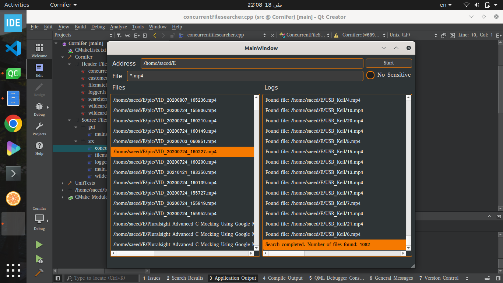

# Cornifer
 A simple cross-platform file search utility with a Qt-based user interface, inspired by Cornifer from Hollow Knight.
 
# ⚙️ Requirements
Compiler: C++17 tested(GCC 10.3.1 or compatible)

CMake: 3.16.3+

Qt: 6.0.1+ (for GUI components)

OS: Tested on Ubuntu 20.04 LTS

# 📦 Dependencies
This project uses CMake's FetchContent to automatically handle dependencies. No manual installation is required.

- [BS::thread_pool](https://github.com/bshoshany/thread-pool): a fast, lightweight, modern, and easy-to-use C++17 / C++20 / C++23 thread pool library
- [GoogleTest](https://github.com/google/googletest): GoogleTest - Google Testing and Mocking Framework
- [spdlog](https://github.com/gabime/spdlog): Fast C++ logging library
- [Qt](https://github.com/qt): Used for GUI

# 🛠 Build & Installation

```bash
git clone https://github.com/SaeedNowroozi/Cornifer.git 
cd Cornifer  
mkdir build && cd build  
cmake ..  
make  
```
## 🎮 Demonstration

